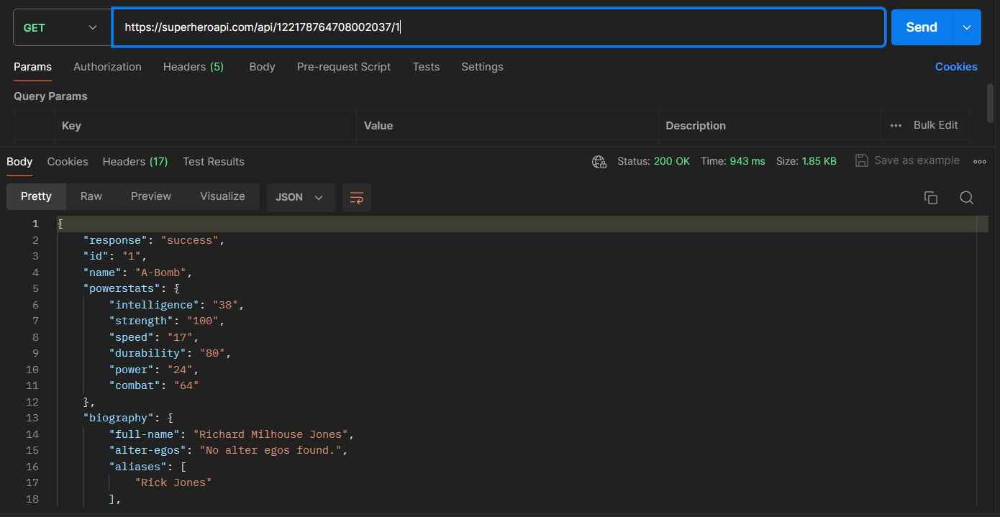
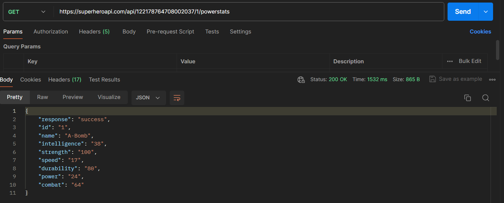
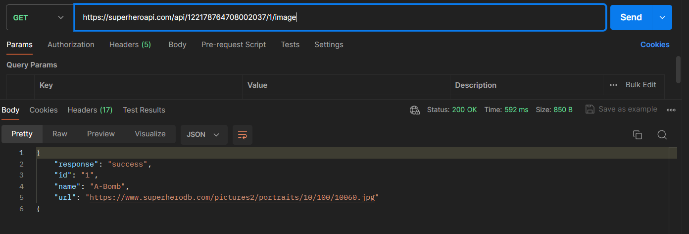

# API Super Hero

## Description courte du projet.

- afichage de toute les donnée selon l'id choisi
- affichage de toute les donnée de statistique du héro choisi
- affichage de l'image du héro choisi

## Instructions d'installation

1. Clonez le depot : `git clone http:...`
2. Creer un repos local
3. Installez les dependances : `npm install`

## Configurations requise 

- Clé API sur [superheroapi.com](https://superheroapi.com/).

## Exemples d'utilisation
### Exemple 1 : Récupérer les donnée du héro selon l'id choisi

```bash
`localhost:3000/superHero/:id``
```

### Exemple 2: récupérer les statistique du héro selon son id

```bash
`localhost:3000/superHero/:id/powerstats``
```

### Exemple 2: récupérer l'image du héro selon son id

```bash
`localhost:3000/superHero/:id/image``
```

### Exemple en image




